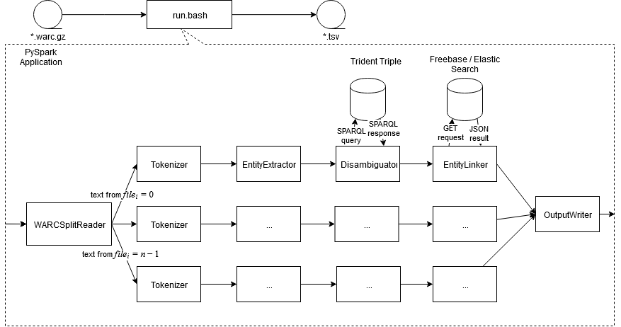

# Architecture Draft

## Input File

## run.bash

Starts the entire pipeline / application.

Needs to:

- Set Pyspark to Python3
- Preprocess Input Warc (Stream / Copy to HDFS?)
- Join the different files on HDFS (output files?)

## Classes

### WARCSplitReader

Input: ?
Output: Spark Dataframe with `document_id` and `text` from the warc file.

### Tokenizer

Only a UDF (encapsuled in a Class -> static function), that is called for each row on the Spark Dataframe doing the NLP processing on the entire text file.

Input: Row from Dataframe
Output Processed Row with list of tokens from file

#### Open Point

- Need to keep track of the surface form?

### EntityExtractor

UDF responsible for recognizing the relevant entities from the list of tokens.

### Disambiguator

UDF that might need to disambiguate certain entity candidates. Uses the Trident store (or other methods) to do so.

### EntityLinker

Links the candidate entity with the dedicated Freebase entity.

### OutputWriter

Transforms all rows into a tab separated string with the format:
`document_id    surface_form    freebase_entity` and then writes as textfile.

## Output File

Singke TSV file, that contains all results from the input file (multiple document ids)
